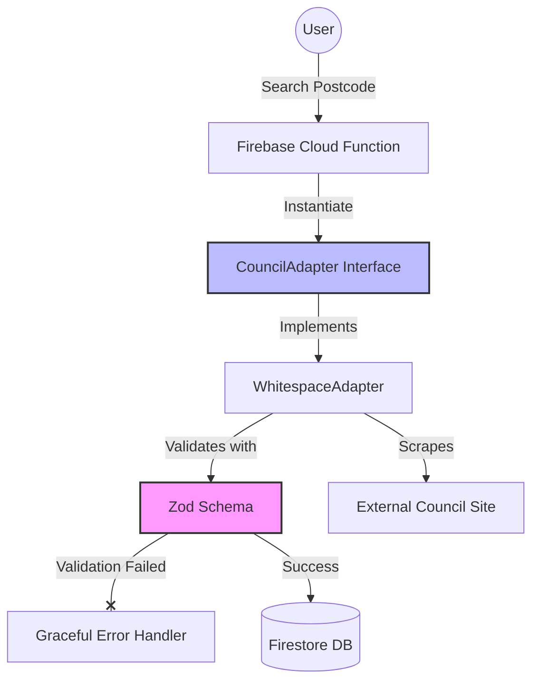

# Bin Day Assistant

 **Commercial Project / Proprietary Source Code**

This repository hosts the **technical documentation and architectural overview** for the Bin Day Assistant application.

The source code (Node.js Backend, Zod Schemas, Scraper Adapters) is currently **Private** as this application is a commercial SaaS product.
>
>However, this repository demonstrates the engineering standards used, including:
* **Architecture Decision Records (ADRs)**
* **UX/UI Previews**

---

## Live Demo

You can test the full application flow, including the Skeleton Loader and Calendar generation, using the **Demo Mode**.

* **URL:** [https://bindayapp-2d5a6.web.app/]
* **How to test:** Click the **"Try Demo Mode"** link under the search bar (or search for postcode `DEMO`).

---

## Project Overview

**Bin Day Assistant** is a serverless Progressive Web App (PWA) that solves a common household problem: knowing exactly when to put the bins out.

Unlike simple static calendars, this system acts as a **real-time bridge** between users and local council databases. It scrapes, normalizes, and monitors complex waste collection schedules, converting them into a user-friendly dashboard and standard `.ics` calendar subscriptions.

## Technical Architecture

The system is built on a **Hexagonal Architecture** (Ports & Adapters) principle to decouple the core business logic from the fragile nature of external council websites.

## Engineering Highlights
1. Resilient Data Pipeline (Runtime Validation)
External websites frequently change their DOM structure, which breaks traditional scrapers.

Solution: Implemented Zod schemas to enforce strict runtime validation on all scraped data.
Outcome: If the council website changes its date format or table structure, the system throws a precise ScraperValidationFailed error rather than propagating corrupt data to the user's calendar.

2. Adapter Pattern (Decoupling)
To support future scalability across different regions, the scraping logic is completely decoupled from the core API.

Solution: A CouncilAdapter interface defines the contract (getAddresses, getSchedule).
Outcome: Vendor-specific logic (e.g., for Whitespace, Bartec, or Veolia) is isolated. Adding a new council requires writing a new Adapter class, not refactoring the engine.

3. Zero-Bundle Frontend (Performance)
The frontend is built without heavy frameworks like React or Vue.

Reasoning: See ADR 001: Adoption of Vanilla JavaScript.
Outcome: Achieves sub-100ms Time-to-Interactive (TTI) on 3G mobile networks, critical for a utility app used transiently.

4. Optimistic UX & Skeleton Loading
Perceived performance is managed during the 1-3 second scraping delay.

Solution: Custom CSS Skeleton Loaders are injected immediately upon user interaction.
Outcome: Reduces bounce rates by providing instant visual feedback that the system is "working," rather than a frozen UI.

# Tech Stack

## Frontend

Core: Vanilla JavaScript (ES Modules)

Styling: Pico.css (Semantic HTML-first framework)

Build Tool: Vite

PWA: Service Worker for offline capabilities + Web Push Notifications

## Backend (Serverless)
Platform: Firebase Cloud Functions (Node.js 20)

Database: Cloud Firestore (NoSQL)

Security: Firebase App Check (ReCAPTCHA v3)

Validation: Zod

## Automation Logic
The backend runs several automated processes to ensure data accuracy:
getCalendar (Smart Caching)

Generates .ics files on demand.

Stale-While-Revalidate: Checks the lastUpdated timestamp. If data is <24h old, it serves from Firestore cache. If >24h, it triggers a background re-scrape.

scraperHealthCheck

A daily cron job that runs a known valid query against the external council site.

If the structure has changed (failing Zod validation), it alerts the admin before users notice.

## Future Roadmap
[ ] Multi-Council Support: Leverage the CouncilAdapter interface to onboard neighboring councils.

[ ] E2E Testing: Expand current unit tests to include full Playwright flows for the critical subscription path.

[ ] SMS Integration: Implement Twilio fallback for users without smartphone data.
